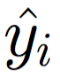
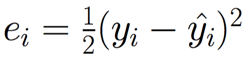
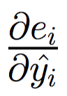

# Building a Shallow Neural Network using `numpy`

In the previous notebook, we looked at a general overview of using gradient descent to solve for the weights and biases of a shallow neural network with non-linear activations. We'll now formalize our gradient descent procedure, and then code it up using `numpy`. 

## Gradient Descent for a Shallow Neural Network

### Gradient Descent Procedure 

Our gradient descent procedure is going to involve the same steps that it did in linear and logistic regression. Formally, we'll take the following steps:

1. Randomly initialize values for our weights and biases: 
,
,
,
,
,
,
and 
. Weights are often initialized following a uniform or normal distribution, whereas biases are frequently initialized with zeros. 

2. While we haven't met some stopping condition: 

 A. Calculate our predicted values, 
.    
 B. Calculate the error for each observation using the true values
, 
our predicted values 
, 
and our error formula: 

 C. For each observation, calculate the gradient of the error with respect to each one of our weights and biases (, 
, 
, 
, 
, 
, 
and 
), and then use the average across observations to update (
 is the learning rate):
 
 
 
 
 
 
 

### Derivative Calculations

We'll revisit the chain rule that we looked at last notebook in order to calculate the gradients for all the observations in 2C:

 
 
 
 
 
  

We can break these equations down into the individual pieces that we need to calculate - 
, 
,
,
,
,
,
,
,
,
,
,
 - and we can calculate these as follows: 

Plugging these back into the original equations, we can obtain our full updates for step 2C:

 
 
 
 
 

Alright, enough math for now. Let's dive into some code!

## Learning A Shallow Neural Network using Gradient Descent with `numpy`

To learn the weights and biases of our shallow neural-network, we'll first need some data. There are two functions in `datasets.general` that we'll use to generate some fake data, and then we'll demonstrate that our neural network is capable of learning the functions that generated this data. 

For the most part, the code below is going to resemble the equations that we've looked at so far. Probably the biggest difference is that we'll create weight and bias vectors per layer, rather than creating individual variables for each weight and bias (see the [appendix](https://github.com/sallamander/neural-networks-intro/blob/master/mini-books/shallow-neural-networks/04-shallow-neural-network/appendix.ipynb) for a non-vector version of the code). This will make the code a little cleaner and a little faster. It's also how standard neural network libraries operate, and it'll be good to start getting used to it while the networks we're building are relatively simple.  