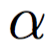
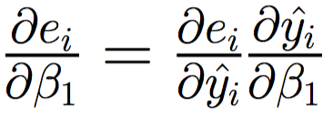
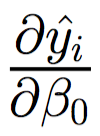

# Simple Linear Regression using Gradient Descent

In the previous notebook, we looked at a high level overview of solving our simple linear regression problem using gradient descent. Now, we'll formalize that, actually calculate the derivatives that we need to implement it, and use `numpy` to do so. 

## Using Gradient Descent for Simple Linear Regression

### Gradient Descent Procedure 

Formally, with gradient descent we will do the following: 

1. Randomly initialize values for our coefficients, 
 and
   

2. While we haven't met some stopping condition:   
 A. Calculate our predicted values, 
, using our simple linear regression equation
().  
 B. Calculate the error for each observation using the true values
, 
our predicted values 
, 
and our error formula: 
      
 C. For each observation, calculate the gradient of the error with respect to each one of our coefficients (
, 

), and then use the average across observations to update the coefficients: 

Note that we are subtracting off the gradient in step 2C because the gradient gives us the direction of steepest ascent (and we want to take the direction of steepest descent to minimize our error). Note also that 
 
in step 2C is simply the learning rate (e.g. how much of the coefficient updates actually get applied). 

Now, let's actually calculate the derivatives. 

### Derivative Calculations

Recall that we'll use the chain rule to calculate the updates that we need for step 2C: 

To calculate these, we'll need three quantities - 
, 
, 
. We can calculate these as follows: 

We can then plug these in to obtain our updates for step 2C: 

Check out these [notes from Andrej Karpathy](http://karpathy.github.io/neuralnets/) for a refresher on gradient descent or a more thorough but still simplistic discussion of backpropagation (the code in the notes is written in `JavaScript`, but it is fairly simplistic and Andrej does an excellent job with his explanations). 

## Simple Linear Regression using Gradient Descent with `numpy`

We'll begin our `numpy` implementation by generating some fake data. To obtain some fake data that follows a univariate linear relationship, we'll use a function from the `datasets/general.py`. With the function `gen_simple_linear`, we'll input a , 
, 
and number of observations. We'll receive as output data that follows a univariate linear relationship specified by 
  
and 
 
(). Using this data, we'll learn the coefficients using gradient descent as specified above. We'll plot the mean-squared-error over each iteration so that we can see our model learning. 