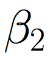
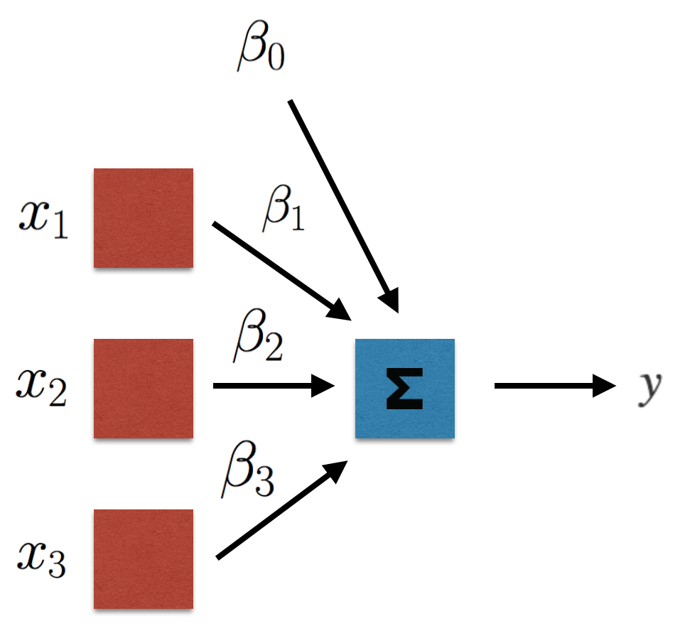
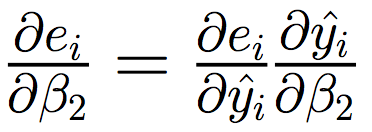

# Multiple Linear Regression: Neural Net Style

The next step in our journey towards neural networks will be to look at multiple linear regression, again from a neural network perspective. We'll solve our multiple linear regression problem via forward and backward propagation using gradient descent, similar to how we would train a neural network. 

## Standard Multiple Linear Regression

We can denote multiple linear regression with the following mathematical formula: 

where each 
 
is an individual column vector (sometimes referred to as a feature vector). To keep our problem relatively simple, we're going to assume that we only have three features. Given that, our mathematical formula above turns into: 

In this case, we'll need to solve for 
, 
 , 
 , 
and
. Just as with simple linear regression, we'll use **squared error** as our error metric. Given that, the error for an *individual observation* is defined by: 

where 
 
is our true value, and 
 
is our predicted value. The average error (**mean squared error**) across *all observations* is then: 

If we were to [solve this multiple linear regression problem](https://isites.harvard.edu/fs/docs/icb.topic515975.files/OLSDerivation.pdf) (without regularization) by minimizing this squared-error using derivatives and matrix algebra, we'd obtain the following closed form solution for our

vector: 

Just as with simple linear regression, though, we can (and will) also solve our multiple linear regression problem using gradient descent...

## Multiple Linear Regression using Gradient Descent

### Multiple Linear Regression in a Computational Graph

Before solving our multiple linear regression problem using gradient descent, we'll view it as a computational graph. This will help us to better visualize and understand neural networks when we later move to those. Visualized as a computational graph, our multiple linear regression looks as follows: 

Just as with our computational graph for simple linear regression, the colored blocks (**nodes**) denote each part of our multiple linear regression equation. Reading the graph from left to right, we can see that each of the coefficients 
, 
, 
and 
 
is multiplied with it's corresponding column vector (
, 
, 
or

), 
as denoted by the blue multiplication nodes. Finally, the results of those multiplications are summed together, along with 
. This is denoted by the blue sum node, and its output is our final output, 
. 

Before looking at the forward and backward propagation steps, let's simplify our visual a little bit (this will help as we build towards more involved graphs). Instead of denoting the multiplication of our coefficients and inputs with two separate nodes, we're going to place the coefficients above the links connecting the input vectors (
, 
, 
and

) with the summation node. For 
, we'll get rid of its node but leave it in the same place. This will help denote that it is not associated with an input vector (or rather, that it's associated with an input vector of 1's). Our simplified visual looks as follows: 

Next, we'll move on to solving our multiple linear regression problem with gradient descent. 

### Solving Multiple Linear Regression via Gradient Descent 

Before formalizing the process for using gradient descent to solve a multiple linear regression problem in the next notebook, let's walk through the **forward** and **backward** propagation steps and view them in a computational graph. 

### Forward Propagation

With forward propagation, we'll simply read our computational graph from **left to right** in order to compute our output (
).

### Backward Propagation

With backward propagation, we'll read our computational graph in reverse, from **right to left**. The inputs that we start out with will be our errors that we calculate for each observation. In backward propagation, we'll calculate the gradient of each of the errors with respect to each of the coefficients, and update the coefficients with the mean of the gradients. To calculate the mean of the gradients, we'll want the following quantities for each observation: 

We'll obtain these quantities in the same way that we did when working through our simple linear regression problem, using the chain rule: 

Visualizing this through our computational graph would look as follows: 

In the next notebook, we'll work through the calculations of those derivatives, and code this up using `numpy`. 