# Multiple Linear Regression using Gradient Descent

In the last notebook, we walked through a high level overview of using gradient descent to solve our multiple linear regression problem. After building in a little more detail and calculating the derivatives that we'll need to perform the update steps, we'll code it up in `numpy`. 

## Gradient Descent for Multiple Linear Regression

### Gradient Descent Procedure 

With gradient descent, we'll do the following: 

1. Randomly initialize values for our coefficients: 
, 
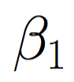 , 
 , and
. 

2. While we haven't met some stopping condition:   
 A. Calculate our predicted values, 
.  
 B. Calculate the error for each observation using the true values
, 
our predicted values 
, 
and our error formula: 
      
 C. For each observation, calculate the gradient of the error with respect to each one of our coefficients (
, 
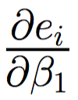, 
, 

), and then use the average across observations to update the coefficients (

 is the learning rate): 
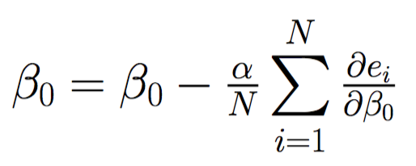

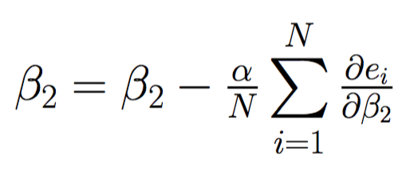
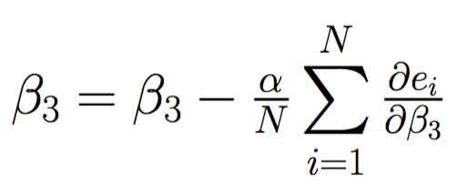

### Derivative Calculations

To calculate the gradients for each observation in 2C, we'll use the chain rule that we looked at last notebook: 

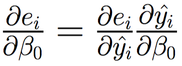

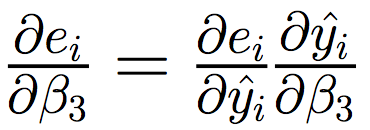

We can break these equations down into calculating each of the individual pieces - 
, 
, 

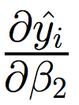, 
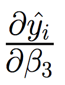. We can calculate those as follows: 

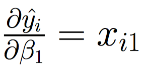

If we plug these back into the original equations, we can obtain our full updates for step 2C: 

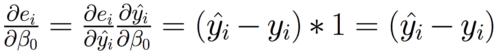
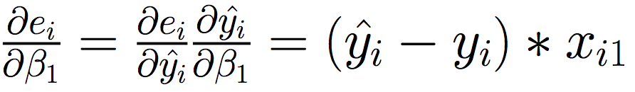

Now, let's code this up! 

## Multiple Linear Regression using Gradient Descent with `numpy`

To demonstrate using gradient descent to solve our multiple linear regression problem, we'll use the `gen_multiple_linear` function from the `datasets/general.py` script to generate some toy data that follows a multivariate linear relationship with three variables. We'll input a `1d numpy array` of betas as well as a number of observations, and it will output data that follows a multivariate linear relationship (
 ). 
With this data, we'll use gradient descent to learn the values for our coefficients. 

In solving our multiple linear regression problem, we'll work exclusively with vectors and matrices. Instead of having individual beta coefficients (like we did with `beta_0` and `beta_1` in simple linear regression), we'll have a beta vector that will hold each of our betas. This means that the first column of the `xs` matrix returned from `gen_multiple_linear` will be a vector of 1's that will be lined up with our 
. Aside from this, our solution for multiple linear regression will look largely the same as our solution for simple linear regression. 