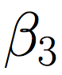
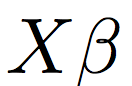

# Logistic Regression: Neural Net Style 

Just as we solved both simple and multiple linear regression from a neural network perspective, we will do the same with logistic regression. That is, we'll solve it with forward and backward propagation using gradient descent. 

## Logistic Regression Overview

With logistic regression, we model the **probability** of success for each individual observation (in a **binary** classification problem, this is simply the probability that each individual observation belongs to a given class). We use the [logistic function](https://en.wikipedia.org/wiki/Logistic_function) to model the output as a linear combination of the inputs while ensuring that it is still bound between 0 and 1. We can denote logistic regression as follows: 

where  
is the probability of success, 

a matrix of input features (with a column of 1's corresponding to the intercept), and 

a vector of beta coefficients. In solving, we'll need to solve for each of these beta coefficients, and later we'll assume three coefficients plus one for the intercept. Although we won't refer to it explicitly as *multiple* logistic regression, it will be our logistic regression equivalent of multiple linear regression. 

Before solving, though, we'll need to define an error metric. We'll use **binary crossentropy** (sometimes referred to as **logloss**) as our error metric, since it's commonly used for logistic regression. With this metric, the error for an *individual observation* is given by the following: 

where 
 
is our true value, and 
 
is our predicted value. Given this, the average error across *all observations* is then: 

Unlike both simple and multiple linear regression, there is no closed-form solution for logistic regression. Typically, it is solved via [maximum likelihood estimation](https://en.wikipedia.org/wiki/Logistic_regression#Model_fitting) using an iterative approach. Newton's method is a common approach, but it's also possible to use gradient descent, which is what we'll do! 

## Logistic Regression Using Gradient Descent 

### Logistic Regression in a Computational Graph 

Just as we viewed our simple and multiple linear regression problems with a computational graph, we'll do the same with logistic regression. It will look incredibly similar to our graph for multiple linear regression, with *one* change. First, recall our computational graph for **multiple linear regression**: 

The computational graph for **logistic regression** looks as follows: 

Note here that we're assuming three features, each of which has an associated beta coefficient ( 
 , 
 , and
), with 
 
corresponding to the intercept. The only difference between this graph and the one for multiple linear regression is the addition of the 
 
in the blue node. This 
 
denotes that the logistic function will be applied to the sum of the inputs to that node. Since we can denote the sum of those inputs as 
, we can denote the application of the logistic function with the following: 

Recall that this is equal to 
...

which gets us back to our logistic regression equation that we saw above. We'll solve this equation for our beta coefficients using gradient descent. Before doing so, we'll make one simplification for our visual. Instead of explicitly denoting the sum in the blue node, we'll **assume** that the inputs to the node are summed, and then some function is applied to that sum (here it's the logistic function, denoted by ). Our computational graph for logistic regression will then look as follows: 

As a final piece of terminology, this function that is applied to the sum is referred to as the **activation function**. In neural-net land, this **logistic** activation function is commonly referred to as the **sigmoid** activation function - we'll use this terminology moving forward.

### Solving Logistic Regression via Gradient Descent

Solving logistic regression via gradient descent is going to follow the same general procedure as solving multiple linear regression with gradient descent, particuarly in consdering that we'll perform both **forward propagation** and **backward propagation**. Let's take a look at those before formalizing the gradient descent procedure in the next notebook...

### Forward Propagation

With forward propagation, we'll simply read our computational graph from **left to right** in order to compute our output (
).

### Backward Propagation

With backward propagation, we'll read our computational graph in the opposite direction, from **right to left**. The inputs that we start out with will be our errors that we calculate for each observation. In backward propagation, we'll calculate the gradient of each of the errors with respect to each of the coefficients, and update the coefficients with the mean of the gradients. To calculate the mean of the gradients, we'll want the following quantities for each observation: 

We'll obtain these quantities in the same way that we did when working through our linear regression problems, using the chain rule: 

Visualizing this through our computational graph would look as follows: 

Note that other than the application of the sigmoid activation function, this looks exactly the same as our forward and backward propagation steps for multiple linear regression! When we actually calculate the derivatives and code this up with `numpy` in the next notebook, we'll see that there are some slight differences, but that most of it will still look pretty familiar.