# Logistic Regression Using Gradient Descent

In the previous notebook, we looked at a high level overview of using gradient descent to solve for the beta coefficients in logistic regression. Now, we'll formalize the gradient descent procedure a little bit more, walk through the calculation of the needed derivatives, and code it all up using `numpy`. 

## Gradient Descent for Logistic Regression 

Before diving into gradient descent, we'll introduce one new piece of notation (this will help with the derivative calculations below) - we're going to denote the weighted sum of the inputs (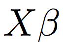) as 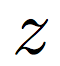. This is common notation for the **weighted sum of the inputs to a node**, and it will come into play with the derivative calculations in step 2C below. 

### Gradient Descent Procedure 

With gradient descent, we'll do the following: 

1. Randomly initialize values for our coefficients: 
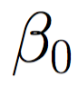, 
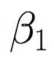 , 
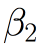 , and
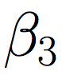. 

2. While we haven't met some stopping condition:   
 A. Calculate our predicted values, 
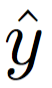.  
 B. Calculate the error for each observation using the true values
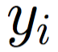, 
our predicted values 
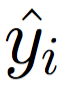, 
and our error formula: 
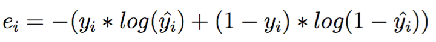    
 C. For each observation, calculate the gradient of the error with respect to each one of our coefficients (
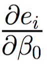, 
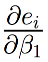, 
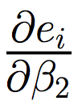, 
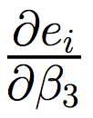
), and then use the average across observations to update the coefficients (
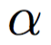
 is the learning rate): 
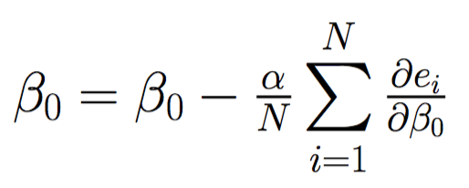
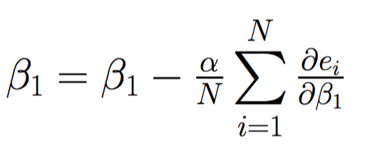
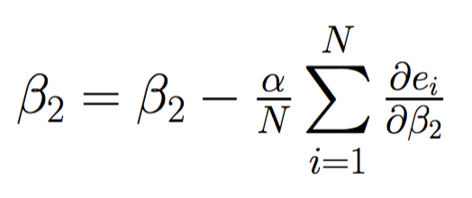
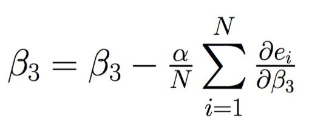

### Derivative Calculations

Before calculating any derivatives, recall that our predicted values, 

, are given by our logistic regression equation: 
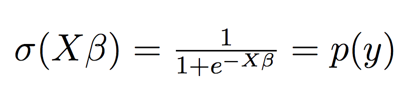 
Recall also that we are now replacing 
 
with 
, which means we can denote our logistic regression equation via: 

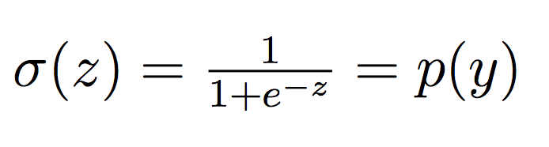

To calculate the derivatives for an individual observation, we'll use the chain rule that we looked at last notebook, but we'll also have to factor in the non-linear activation function we're now applying (e.g. the sigmoid activation). To denote this, we'll break apart the derivatives of the output with respect to the coefficients (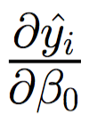, 
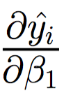
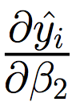, 
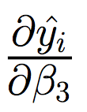), and denote 

as 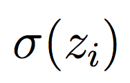:

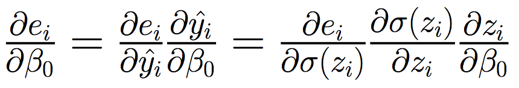
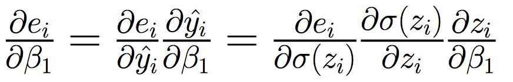
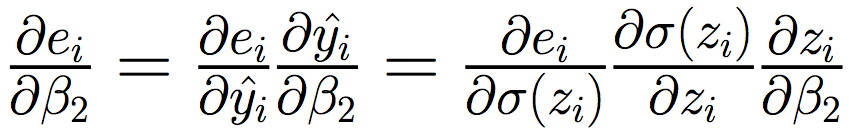
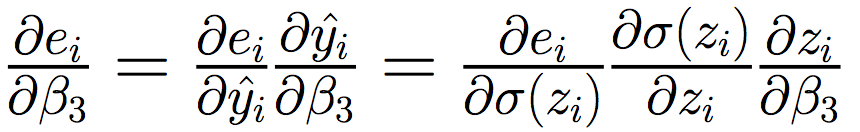

The first two pieces of each of the above chain rules are what we looked at last notebook, whereas the third (rightmost) piece is where we've broken apart the derivatives of the output with respect to the coefficients. For each of these rightmost pieces, we can break them down even farther into each of the individual pieces - 
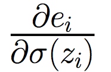, 
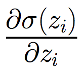, 
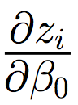, 
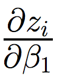, 
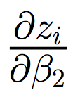, 
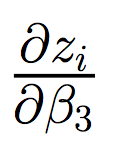. We can calculate those as follows: 

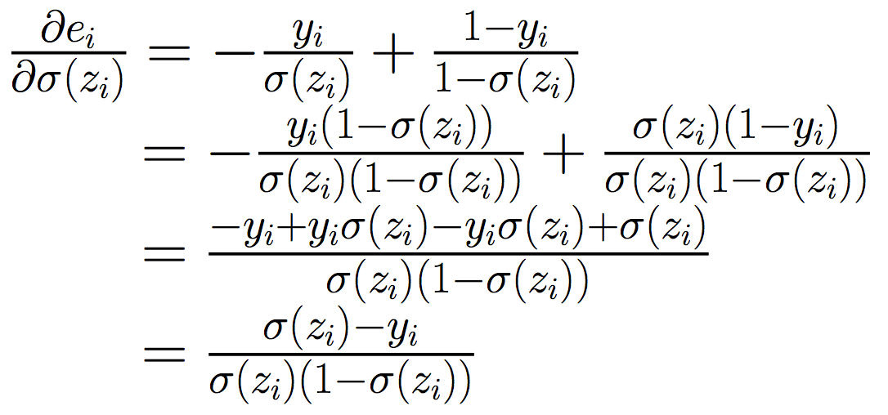 
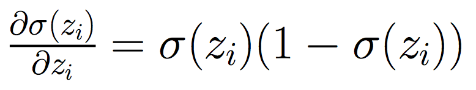 
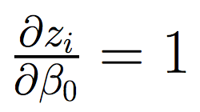
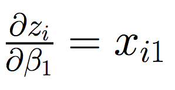
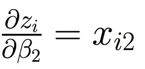 
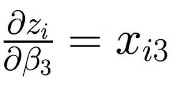

If we plug these back into the original equations, we can obtain our full updates for step 2C: 

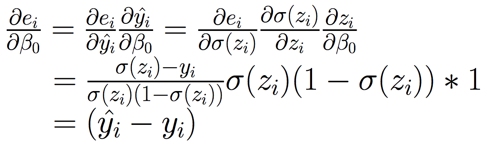
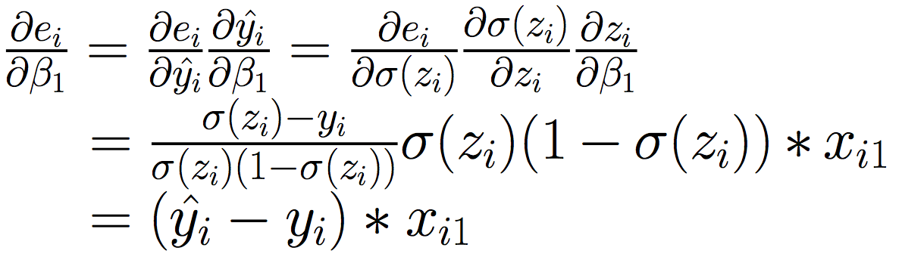

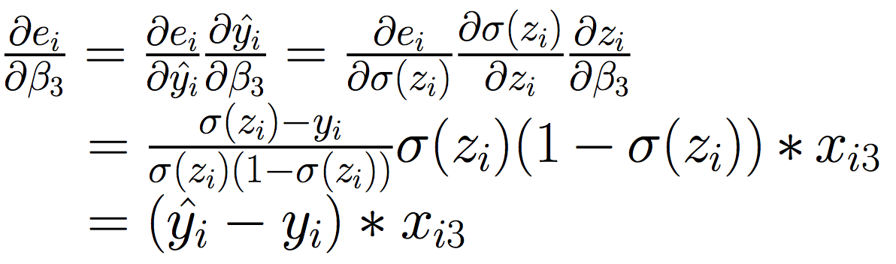

Note that in the final step of each of the update steps, we have switched from  
back to 
. This was so that we could see that these are the exact same update steps that we used in solving multiple linear regression with gradient descent! It turns out that when we use a **sigmoid activation function** in combination with **binary crossentropy loss**, we obtain the same update steps as when we use an **identity activation** in combination with **squared error loss**. This means that when we code this up with `numpy` below, the only difference from our `numpy` implementation for multiple linear regression will be the forward pass where we calculate our predicted values. The backward pass will look exactly the same! 

## Logistic Regression using Gradient Descent with `numpy`

To demonstrate using gradient descent to solve logistic regression, we'll use the `gen_multiple_logistic` function from the `datasets/general.py` script to generate some toy data that follows a multivariate logistic relationship with three variables. We'll input a `1d numpy array` of betas as well as a number of observations, and it will output data that follows a multivariate logistic relationship (
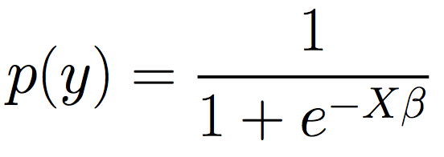 ). We'll then binarize this data by labeling all those observations greater than 0.5 with a `1`, and all those less than or equal to 0.5 with a `0`.