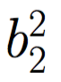

# Our First Neural Network

We'll now work towards coding up our first *true* neural network (I'll detail exactly what I mean by that in a second). To do so, we'll revisit and build upon some of the concepts introduced in prior chapters, as well as introduce new ones. 

## A Shallow Neural Network With Identity Activations 

### Without Connections

We'll create our first neural network by revisiting our computational graph for simple linear regression, but add in a new layer. In addition to having an input and output layer, we'll have a layer in between (a **hidden layer**). If we *ignore the connectivity* of the graph for a second, we can visualize it as follows: 

In terms of the individual pieces, we now have more, but each of these take on the exact same meaning as they did previously - the blue nodes with the  denote that we are taking a weighted sum of the inputs to that node and then applying the identity function
()
.

The only real difference between this computational graph and the one we looked at for simple linear regression is the addition of the **hidden layer**. While there are differing opinions as to why the middle layer is called a **hidden layer** (which we won't get into), we'll define a **hidden layer** to be any layer that is not the input or output layer. The presence of a hidden layer is what we'll treat as defining a *true* neural network, such that we're now viewing our first *true* neural network. Traditionally, a neural network with only one hidden layer has been referred to as a **shallow** neural network, as opposed to a **deep** neural network that has two or more hidden layers. 

### With Connections

Let's now build in the connectivity. We'll read the graph from left to right, and assume that every node in one layer is connected to every node in the subsequent layer (reading left to right), but no nodes in prior layers. We'll also add in an intercept term for each node in the hidden and output layers. In our graph, we'll represent connections with lines , and each connection will have an associated **weight** (except for the intercepts, whose weights will simply be `1`). Adding all of this in, our computational graph becomes the following:

There is a lot flying around here, so let's define some terminology:

1. Each  
represents the weight associated with the connection from the 
 
node in the 
 
layer to the 

in the 
 
layer. For example, 
 
represents the weight connecting Node 1 in Layer 1 to Node 2 in Layer 2, while 

represents the weight connecting Node 1 in Layer 2 to Node 1 in Layer 3. Note that we can think of these weights as the coefficients that we looked at in linear and logistic regression.

  
 **Note**: If you read [Chapter 2 of Neural Networks and Deep Learning](http://neuralnetworksanddeeplearning.com/chap2.html), you'll note that the `i` and `j` indices are switched. This avoids the use of a tranpose operation later on, but aside from that the math is all the same. 
    
 
2. Each  
represents an intercept term associated with the 
 
node in the 
 
layer. For example, 
  is the intercept term associated with Node 2 in Layer 2. In neural-network land, each intercept is referred to as a **bias**, which is the terminology we'll use moving forward. 

From a high level, this computational graph acts similarly to the ones we looked at for linear and logistic regression - each node receives a weighted sum of its inputs and applies some activation function to it.

We'll note again that inputs flow only **forward** through the network (left to right), and that each node in one layer is connected to each node in a subsequent layer (e.g. each node in Layer 1 is connected to each node in Layer 2, and each node in Layer 2 is connected to each node in Layer 3). We often refer to a neural network where these properties are true as a **feedforward, fully-connected** neural network, where the **feedforward** part refers to the former property and the **fully-connected** part the latter. Here, we have only one node in Layer 1, but we could have many (we've chosen one so that it's easy to visualize the functions we'll model later on). We could similarly have more than 2 nodes in the hidden layer, and more than 1 in the output layer. Neural networks are extremely flexible and extensible. 

Let's take a little deeper of a look at this **feedforward, fully-connected** neural network with identity activations...

## A Feedforward, Dense Neural Network with Identity Activations

Let's dive right in by denoting the feedforward, dense neural network with identity activations formulaically: 

Here, we're using the same process that we used with the prior computational graphs we looked at - each node takes a weighted sum of it's inputs and applies an activation function (here the identity function, which simply outputs its input). For Layer 2, its outputs become part of the inputs for Layer 3. 

### It's *Just* Linear Regression

I'm going to posit that this representation, our first *true* neural network, is actually just glorified linear regression. To demonstrate, let's suppose that 
 
and 
 
are both 0. Both of these have some true value, and we're just assuming that we know it, and it's 0. Given that, our formula above reduces to the following: 

Let's further suppose that 
 
is equal to 1. With that assumption, we can reduce our formula even farther: 

Finally, if instead of using

and 

we use
 and
,
we recover our simple linear regression equation: 

So, we can perform linear regression with a neural network. But, this isn't terribly useful, and really doesn't give us anything new. While it might be the case that this neural network can more readily pick up interactions between features than standard simple linear regression, we still don't gain that much predictive power when we build a neural network using exclusively *identity* activations. The real power comes when we build a neural network with primarily non-linear activations, which we'll do in the next notebook!